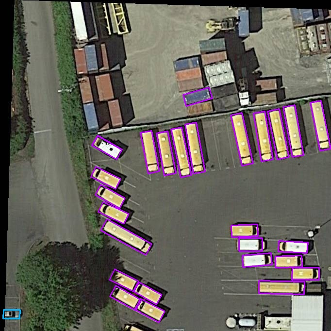

# YOLOv10OBB

YOLOv10OBB is a customized version of YOLOv10, designed to support Oriented Bounding Boxes (OBB). This enhancement allows precise detection of objects with arbitrary orientations, making it ideal for tasks like aerial imagery analysis, scene text detection, and rotated object detection.

### DOTA Dataset Evaluation Results
Trained and tested using the singlescale strategy on the DOTAv1 dataset.

| model      | MAP50<sub>test</sub> | MAP75<sub>test</sub> | MAP<sub>test</sub>  |
|-------------|-----------------------|-----------------------|------|
| YOLOV8-0BB   | 75.04                | 44.19                | 44.39|
| YOLOV10-0BB  | 76.39                | 44.21                | 44.88|

## Features
- **Oriented Bounding Box Support (OBB):** Detect objects with arbitrary angles.
- **Fast and Accurate:** Built on the YOLOv10 architecture for speed and efficiency.
- **Easy to Use:** Simple setup and integration.

---

## Installation and Setup

### Step 1: Create a Python Environment
It’s recommended to use a virtual environment for clean dependency management. Use the following commands:

```bash
conda create -n yolov10obb python=3.9
conda activate yolov10obb
```
### Step 2: Create a Python Environment
Install the specific version of the ultralytics library:

```bash
pip install ultralytics==8.3.32
```

### Step 3: Replace the Ultralytics Module
Copy the ultralytics module from this repository and replace the installed ultralytics module in your environment's ```site-packages ```directory.
To locate your environment’s site-packages, run:
```
python -m site
```

### Training Example


```python
import cv2
from PIL import Image
from ultralytics import YOLO
model = YOLO("yolov10obb.yaml",task="obb")  # build a new model from 
results = model.train(
    data="dotav1.yaml",
    epochs=200,
    imgsz=1024,
    project="single",
    batch=16,
    val=True,
    exist_ok=True,
    device="0"
)
```
Note: The data augmentation parameters used for training can refer to the train.py file.

### Prediction Example

```python
import cv2
from PIL import Image

from ultralytics import YOLO

model = YOLO("single/train/weights/best.pt") #pretrained model

# from PIL
im1 = Image.open("P0003__682__0___0.jpg")
results = model.predict(source=im1, save=True)  # save plotted images

```

